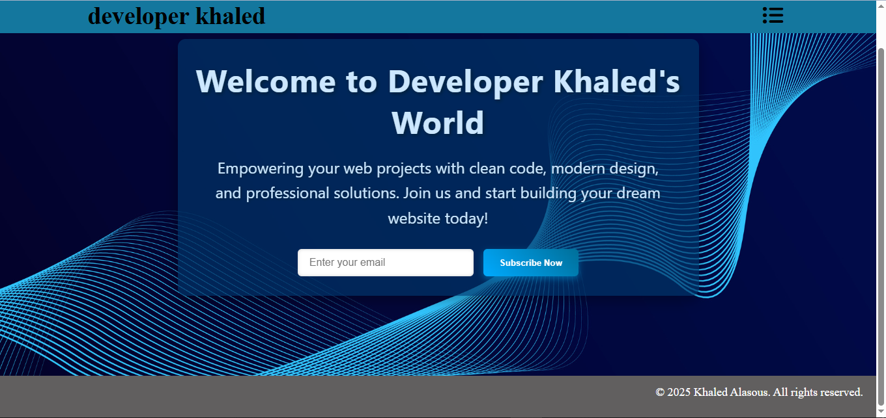

# Responsive Landing Page – Developer Khaled

A modern and responsive landing page featuring a fixed navigation bar with a dropdown menu, a stylish hero section, and a subscription form.  
Built using **HTML** and **CSS**, optimized for all devices, and designed with a clean, professional user interface.

---

## Demo
- **Live Preview:** [View on GitHub Pages](https://KhaledAlasous.github.io/Landing_page/)
- **Source Code:** [GitHub Repository](https://github.com/KhaledAlasous/Landing_page)

---

## Screenshots
This image for disktop :
  
This image for mobile :
*Note: The mobile view includes scroll functionality to ensure the content is fully visible, well-organized, and user-friendly across all devices.*

---

##  Features
- Fixed Navbar with dropdown menu  
- Modern Hero Section with welcome text and call-to-action  
- Subscription Form with interactive styles  
- Fully Responsive Design for desktop, tablet, and mobile  
- Cross-browser Compatibility  

---

## Technologies Used
- HTML5  
- CSS3 (Flexbox, Media Queries)  
- Font Awesome Icons  

---

## Project Structure
├── index.html
├── main.css
├── favicon.ico
├── vecteezy_abstract-wave-line-pattern-on-dark-blue-background_49925799.jpg
└── assets/
├── screenshot1.png
└── assets/
├── screenshot2.png
└── screenshot3.png
